# SHRED Tax Credit Analysis System

A comprehensive system for analyzing Canadian SHRED (Scientific Research and Experimental Development) tax credit eligibility using AI and web search integration.

## 🏗️ System Architecture

This project consists of multiple components working together to provide professional-grade SHRED analysis:


## 📁 Project Structure


## 🔄 System Flow

### 1. Main Chatbot Flow

```mermaid
sequenceDiagram
    participant User as 👤 User
    participant UI as 🌐 Web Interface
    participant Server as 🖥️ Express Server
    participant Google as 🔍 Google API
    participant Claude as 🤖 Claude API
    
    User->>UI: Enter task description + company context
    UI->>Server: POST /api/analyze
    Server->>Google: Search SHRED requirements
    Google-->>Server: Current SHRED info
    Server->>Server: Create analysis prompt
    Server->>Claude: Send prompt for analysis
    Claude-->>Server: SHRED eligibility analysis
    Server-->>UI: Formatted response
    UI-->>User: Display analysis + follow-up questions
```



### 2. MCP Server Architecture


## 🛠️ How MCP (Model Context Protocol) Works

### MCP Overview

MCP is a protocol that allows AI assistants to connect to external tools and services. Think of it as a standardized way for AI to "plug into" different capabilities.

### Our MCP Servers Explained

#### 1. Google Search MCP (`MCP/google/`)

**Purpose**: Provides Google search capabilities to AI assistants


**Key Components**:
- **Tool Name**: `google_search`
- **Parameters**: `query`, `num_results`
- **Output**: Formatted search results with titles, URLs, snippets

#### 2. SHRED Analyzer MCP (`MCP/shred-analyzer/`)

**Purpose**: Generates professional SHRED analysis prompts


**Key Components**:
- **Tool Name**: `analyze_shred_eligibility`
- **Parameters**: `task_description`, `company_context`
- **Output**: Professional analysis prompt for AI assistants

#### 3. SHRED Research MCP (`MCP/shred-research/`)

**Purpose**: Combines Google search with SHRED analysis


**Key Components**:
- **Tool Name**: `research_shred_eligibility`
- **Parameters**: `task_description`, `nlpany_context`, `search_depth`
- **Output**: Complete analysis with current SHRED research

## 🌐 Web Server Architecture

### Express.js Server (`chatbot/server.js`)


### Frontend Architecture (`chatbot/public/index.html`)


## 🔧 Technical Implementation Details

### 1. Component-by-Component Analysis

The system uses a sophisticated approach to handle mixed tasks:


### 2. SHRED Analysis Framework


### 3. Follow-up Question System


## 🚀 Setup Instructions

### Prerequisites


### 1. Main Chatbot Setup

```bash
# Navigate to chatbot directory
cd chatbot

# Install dependencies
npm install

# Configure environment variables
cp ../MCP/google/env.example .env

# Edit .env file with your API keys
# GOOGLE_API_KEY=your_google_api_key
# ANTHROPIC_API_KEY=your_anthropic_api_key

# Start the server
npm start
```

### 2. MCP Server Setup


## 🔑 API Configuration Flow


## 📊 Usage Examples

### Web Interface Usage Flow


### MCP Server Usage Flow


## 🎯 Key Features Overview


## 🔍 Troubleshooting Flow


## 📈 System Benefits


## 🤝 Contributing Areas

```mermaid
graph LR
    A[Contribution Opportunities] --> B[New MCP Tools]
    A --> C[Enhanced UI]
    A --> D[Integration Options]
    A --> E[Analysis Algorithms]
    
    B --> F[Additional Analysis Capabilities]
    C --> G[Better User Experience]
    D --> H[More External Services]
    E --> I[Improved SHRED Evaluation]
    
    style A fill:#e1f5fe
    style F fill:#e8f5e8
    style G fill:#e3f2fd
    style H fill:#fff3e0
    style I fill:#f3e5f5
```

## 📄 License

MIT License - See individual component README files for specific licensing information.

---

This comprehensive system provides professional-grade SHRED tax credit analysis with intelligent task breakdown, real-time research integration, and expert AI analysis capabilities.